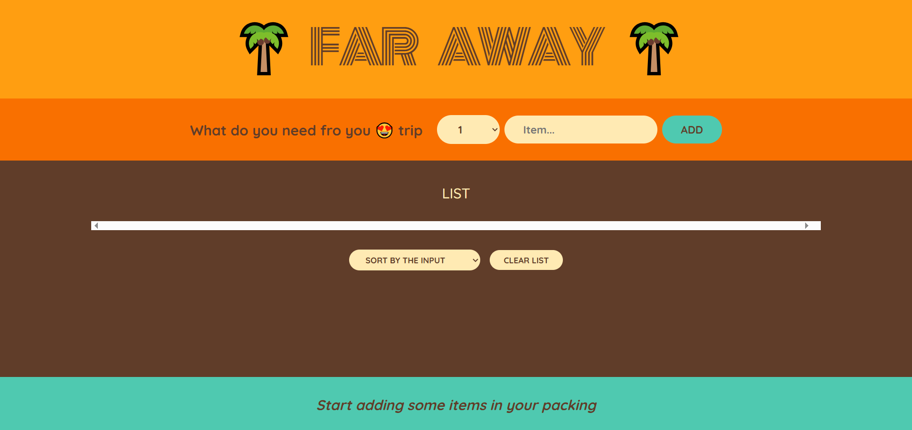

# 🧳 Travel List

Travel list is a simple React-based travel packing list app to help users efficiently manage items before a trip. It displays added items, tracks what has been packed, and shows a progress percentage.

## 🚀 Features

- ✅ Add items to your travel packing list
- 📦 Mark items as packed or unpacked
- 🔢 Displays the total number of items in your list
- 🔤 Sort items by:
  - Name
  - Packed status
  - Default order (added order)
- 📈 Footer displays a real-time percentage of items packed

## 🖼️ UI Overview

## 🛠️ Tech Stack

- **React.js**
- **HTML**
- **CSS**

## 🚀 Live Demo

## 📁 Project Structure

<pre>
travel-list/
│
├── public/
│ └── index.html
│
├── src/
│ ├── App.js
│ ├── index.js
│ └── styles.css
│
├── package.json
└── README.md
</pre>

## 📄 License

MIT License

Copyright (c) 2025 Tejas

Open source under the 
